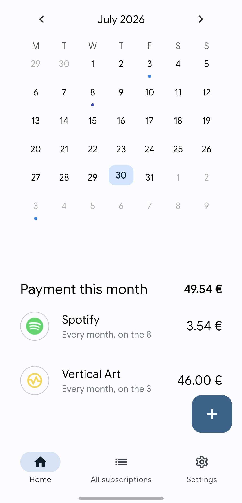
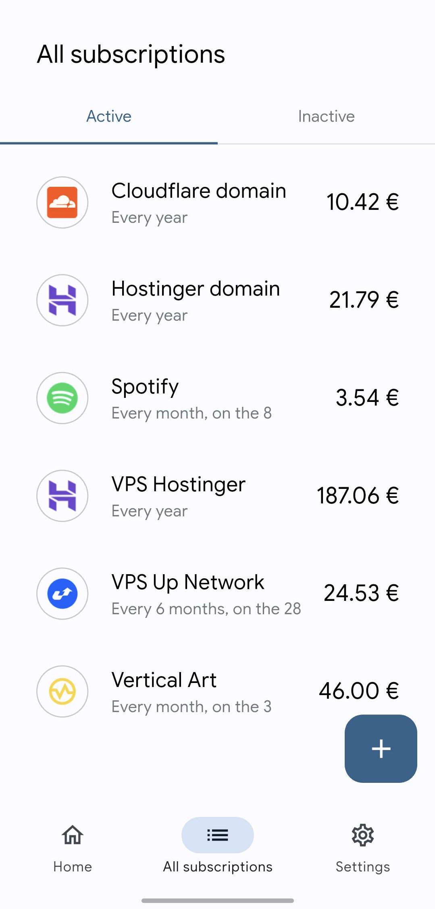
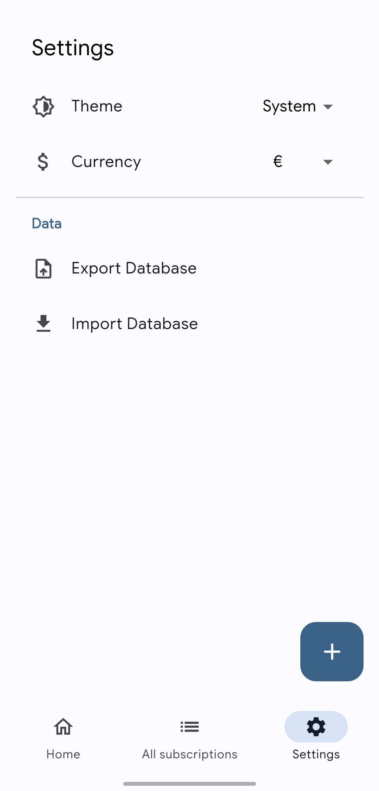

<div align="center">
  

  # Amber Calendar
  
  **A beautiful and intuitive subscription tracker to help you manage your recurring expenses.**

</div>

Amber Calendar helps you regain control over your subscriptions and recurring payments. With the rapid growth of subscription-based services, it's easy to lose track of where your money goes every month. Amber provides a unified, calendar-driven interface to visualize upcoming payments, calculate monthly budgets, and never miss a renewal again.

## Features

- **Interactive Calendar View:** See all your upcoming payments for the current month at a glance.
- **Budget Tracking:** Instantly calculate your total monthly expenses.
- **Advanced Payment Cycles:** Support for monthly and yearly subscriptions, with the ability to set specific end dates or stop after a certain number of payments.
- **Dynamic Currency Support:** Choose your preferred currency (EUR, USD, GBP, JPY, etc.) which automatically adapts to your device's locale.
- **Active & Inactive History:** Keep track of past subscriptions for a complete financial record.
- **Offline First:** All data is securely stored locally on your device using a robust SQLite database.

## Screenshots

<p align="center">
  
  &nbsp; &nbsp;
  
  &nbsp; &nbsp;
  
  &nbsp; &nbsp;
  
</p>

## Getting Started

### Prerequisites

To build and run this project, you need to have the following installed:
- [Flutter SDK](https://docs.flutter.dev/get-started/install) (latest stable version)
- Dart SDK

### Installation

1. Clone the repository:
   ```bash
   git clone https://github.com/yourusername/amber_calendar.git
   ```

2. Navigate to the project directory:
   ```bash
   cd amber_calendar
   ```

3. Install the dependencies:
   ```bash
   flutter pub get
   ```

4. Run the application:
   ```bash
   flutter run
   ```

## Built With

- **Flutter & Dart:** For cross-platform UI and mobile development.
- **Drift (SQLite):** For robust local database storage and offline capabilities.
- **Provider:** For simple and predictable state management.
- **Table Calendar:** For the highly customizable calendar interface.


## License

This project is licensed under the WTFPL, see the license file for more details.
